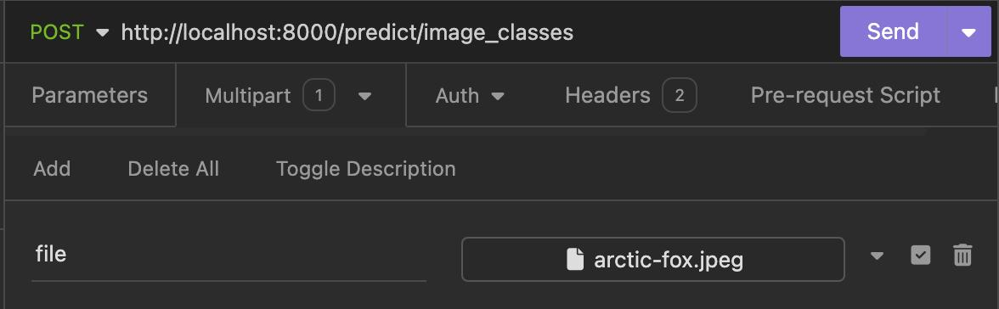

# Deploying Deep Learning Models as a Web Server

## Introduction

Deploying deep learning models as a web server enables real-time predictions and makes the model accessible via standard web protocols, making it an ideal approach for bringing machine learning models into production and ensuring they deliver value in a reliable and scalable manner. This documentation provides a comprehensive guide on deploying a deep learning model using FastAPI, a modern, fast (high-performance), web framework for building APIs with Python 3.7+.
There are various options fof using web server:
1. Flask
2. Fast API
3. Django

[How we used FastAPI to deploy DL models](#how-we-used-fastapi-to-deploy-dl-models)
  - [Setting up the server](#setting-up-the-server)
  - [Image Classification Model](#image-classification-model)
  - [Document Summarization Models](#document-summarization-models)
  - [Deployment](#deployment)

## Why FastAPI?

FastAPI offers several advantages for deploying deep learning models:
- **High Performance**: FastAPI is much faster than the flask because it’s built over ASGI (Asynchronous Server Gateway Interface) instead of WSGI (Web Server Gateway Interface) s the flask is built on.
- **Ease of Use**: With automatic interactive API documentation and validation, FastAPI is easy to use and helps in rapid development. The framework follows the minimalist approach of Flask.
- **Type Safety**: FastAPI is designed around Python type hints, that makes code more readable and lowers the risk of runtime problems.

#fast api using pydantic
## How to use FastAPI
- **FastAPI Installation**
```bash
pip install fastapi
```
FastAPI doesn’t come with any built-in server application. To run FastAPI app, you need an ASGI server called uvicorn, so install the same too.
```bash
pip install uvicorn
```

- **Getting started with FastAPI**
Declare the application object of FastAPI class. This app object is the main point of interaction of the application with the client browser. The uvicorn server uses this object to listen to client’s request.
```bash
app = FastAPI()
```

Create a simple API
```bash
@app.get("")
def read_root():
    return {"Hello": "World"}
```


- **Running the Server**
To run the server, save the above code to a file main.py
Execute the following command in your terminal:
```bash
uvicorn main:app --reload
```
This starts the FastAPI server with auto-reload enabled, so any changes to the code will automatically restart the server.

## Test the FastAPI Application
Open your web browser and go to http://127.0.0.1:8000. You should see a JSON response with the message: 
```json
{"message": "Hello, World!"}
```

- **Adding new End-Point**
Define a Pydantic model Item using BaseModel to validate the structure and types of incoming JSON data for the POST endpoint /items/.
Create a function, create_item. It will accept an Item object as input, and returns a JSON response containing the item's details (name, price, is_offer).

```bash
from fastapi import FastAPI
from pydantic import BaseModel

app = FastAPI()

class Item(BaseModel):
    name: str
    price: float
    is_offer: bool = None

@app.post("/items/")
def create_item(item: Item):
    return {"name": item.name, "price": item.price, "is_offer": item.is_offer}
```

- **Test the API with input**
Use an API testing tool like Postman or curl to send a POST request to http://127.0.0.1:8000/items/ with a JSON body:
```json
{
  "name": "Sample Item",
  "price": 10.5,
  "is_offer": true
}
```

You should recieve a JSON response:
```json
{
  "name": "Sample Item",
  "price": 10.5,
  "is_offer": true
}
```

Congratulations on building your first API. 

- **Interactive API Docs**
FastAPI generates a "schema" with all your APIs using the OpenAPI standard for defining APIs. The OpenAPI schema is what powers the two interactive documentation systems included in FastAPI.

To see the documentation, just add `/docs` to the url (`http://127.0.0.1:8000/docs`). This link will show automatic interactive API documentation.


Click on `Try it out` button in the top right corner to test the API.


# Deploying Deep Learning Models
## Prerequisites

Before starting, ensure you have the following:
- Python 3.7+
- Docker

## Installation

### Python Environment

First, set up a Python environment. It's recommended to use `venv` or `conda` for creating an isolated environment.

```bash
# Create a virtual environment
python -m venv myenv

# Activate the virtual environment
# On Windows
myenv\Scripts\activate

# On Unix or MacOS
source myenv/bin/activate
```

### Installing dependencies
```bash
pip install fastapi uvicorn transformers torch torchvision
```

### Project Structure
my_fastapi_app/
├── app.py
├── model/
│   └── best_model.pth
├── utils.py

### Importing the libraries
```bash
import os
import logging
from fastapi import FastAPI, File, UploadFile, HTTPException
from utils import load_image, predict_octmnist
from fastapi.responses import JSONResponse
from pydantic import BaseModel
from transformers import pipeline
```

### Initiallizing the FastAPI
```bash
app = FastAPI()

# basic logging configuration to log all the debugging information 
logging.basicConfig(
    level=logging.DEBUG,
    filename="app.log",
    filemode="a",
    format="%(asctime)s - %(levelname)s - %(message)s",
)

# install logger
logger = logging.getLogger(__name__)
```

### Model used for the Web App
This tutorial provides a comprehensive guide on deploying a FastAPI application that integrates two different models:
1. Image Classification:
We have Utilized the **'nvidia/mit-b0'** model from Hugging Face's Transformers library to classify the imported file image.

2. Text Summarization
We have used two models - **'T5-small'** and **'facebook/bart-large-cnn'** from Hugging Face's Transformers library. This model is capable of generating concise summaries of longer text documents given as input.

### Model Implementation
#### Loading the Model
```bash
# Load the models when the server first starts
img_classification_model = load_img_classification_model()
t5_model = load_t5_model()
bart_summarizer = (
    load_bart_pipeline()
) 
```

#### Root Endpoint
This endpoint serves as the root of the FastAPI application, providing a simple welcome message when accessed. 
It confirms that the application is running and accessible.
```bash
@app.get("/")
def root() -> dict:
    """
    Root endpoint returning a welcome message.

    Returns:
        dict: A dictionary containing a welcome message.
    """
    return {"message": "Welcome to the ML Model API"}

```

#### 1. Image Classification
The endpoint '**/predict/image_classes**' uses POST method and accepts an uploaded image file and predicts its class label from a set of 1000 ImageNet classes using image classification model - '**nvidia/mit-b0 model**'. 
And, it returns a JSON response containing the predicted class label.

```bash
@app.post("/predict/image_classes")
async def predict_img_class(file: UploadFile = File(...)) -> JSONResponse:
    """
    Endpoint to predict classes for each image among on the 1000 ImageNet classes.

    Args:
        file (UploadFile): The uploaded image file.

    Returns:
        JSONResponse: A JSON response containing the predicted class label.

    Raises:
        HTTPException: If any error occurs during processing.
    """
    try:
        # Load image from the uploaded file
        inputs = load_image(await file.read())

        # Load the model here or during the first start of the server
        # img_classification_model = load_img_classification_model()

        # Predict the class label for the input image
        predicted_class_label = predict_img_labels(inputs, img_classification_model)

    except Exception as exception:
        raise HTTPException(status_code=400, detail=str(exception))

    return JSONResponse(content={"class_label": predicted_class_label})

```

#### 2. Text Summarization
The endpoint enables user to provide parameter to specify the model to be utilized for summarization. Either **'T5-small'** or **'facebook/bart-large-cnn'**.  
The request accepts text to be summarized and returns the response in JSON format


```bash
@app.post("/predict/text_summarize")
async def text_summarize(
    request: TextRequest, model: str = "t5", min: str = "30", max: str = "130"
) -> JSONResponse:
    """
    Endpoint to summarize text using the specified model.

    Args:
        request (TextRequest): The request body containing the text to summarize.
        model (str): The model to use for summarization (default is "t5").

    Returns:
        JSONResponse: A JSON response containing the summary.

    Raises:
        HTTPException: If any error occurs during processing.
    """
    try:
        # Raise an exception if the posted string is empty
        if not request.text.strip():
            raise HTTPException(status_code=400, detail=str("Text cannot be empty"))

        if model == "t5":
            # preprocess the input text
            sequence = request.text
            tokenizer = load_tokenizer()
            inputs = tokenizer.encode(
                "summarize: " + sequence,
                return_tensors="pt",
                max_length=512,
                truncation=True,
            )
            # Load the model here or during the first start of the server
            # t5_model = load_t5_model()

            # Generate summary using the T5 model
            output = t5_model.generate(inputs, min_length=80, max_length=100)
            summary = tokenizer.decode(output[0])

        elif model == "bart":
            # raise HTTPException(
            #     status_code=400, detail=str("We do not support BART model yet.")
            # )

            # Load the model here or during the first start of the server
            # bart_summarizer = (
            #     load_bart_pipeline()
            # )  # this would time out as the model is too large

            output = bart_summarizer(
                request.text, max_length=int(max), min_length=int(min), do_sample=False
            )
            summary = output[0]["summary_text"]

        else:
            raise HTTPException(status_code=400, detail=str("Invalid model specified."))

    except Exception as exception:
        raise HTTPException(status_code=400, detail=str(exception))

    return JSONResponse(content={"summary": summary})

```

### Running the Application
Run the FastAPI application using Uvicorn.
```bash
uvicorn app:app --host 0.0.0.0 --port 8000 --reload
```

### Docker Deployment
For this project, we have used containerized deployment. 
For this, create a **'Dockerfile'**.

```bash
FROM python:3.12-slim

WORKDIR /app

COPY . .

RUN pip install fastapi uvicorn pillow torch transformers sentencepiece

EXPOSE 8000

CMD ["uvicorn", "app:app", "--host", "0.0.0.0", "--port", "8000", "--reload"]
```

Build and run the Docker container on root directory:
```bash
docker-compose up --build
```

### Usage
Use an API testing tool like Postman or curl to send a POST request.

- **Image Classification**
    - Set the request method to POST
    - Enter endpoint URL -  `http://localhost:8000/image_classes`

    - 
    - Response:
    ```json
    {
	"class_label": "Arctic fox"
    }
    ```

- **Text Summarization**
    - Set the request method to POST
    - Enter endpoint URL -  `http://localhost:8000/summarize?model=t5` 
    - JSON body:
    ```json
    {
    "text": "SECTION 1. SHORT TITLE. This Act may be cited as the ``Public Safety and Protection Investment Act of 2003''. SEC. 2. BUSINESS DEDUCTION FOR PURCHASE AND INSTALLATION OF SECURITY DEVICES. (a) In General.--Part VI of subchapter B of chapter 1 of the Internal Revenue Code of 1986 (relating to itemized deductions for individuals and corporations) is amended by inserting after section 179A the following new section: ``SEC. 179B. SECURITY DEVICE PURCHASES. ``(a) Allowance of Deduction.--A taxpayer may elect to treat the cost of any qualifying security device as an expense which is not chargeable to capital account. Any cost so treated shall be allowed as a deduction for the taxable year in which such device is placed in service. ``(b) Definitions.--For purposes of this section-- ``(1) Qualifying security device.--The term `qualifying security device' means a security device (to which section 168 applies) which is acquired by purchase (as defined in section 179(d)(2)) and which is installed or placed in service in a building which is owned or occupied by the taxpayer and which is located in the United States. ``(2) Security device.--The term `security device' means any of the following: ``(A) An electronic access control device or system. ``(B) Biometric identification or verification device or system. ``(C) Closed-circuit television or other surveillance and security cameras and equipment. ``(D) Locks for doors and windows, including tumbler, key, and numerical or other coded devices. ``(E) Computers and software used to combat cyberterrorism. ``(F) Electronic alarm systems to provide detection notification and off-premises transmission of an unauthorized entry, attack, or fire. ``(G) An electronic device capable of tracking or verifying the presence of assets. ``(H) High efficiency air filtering systems. ``(I) Mechanical and non-mechanical vehicle arresting barricades. ``(J) Metal detectors. ``(K) Signal repeating devices for emergency response personnel wireless communication systems. ``(L) Components, wiring, system displays, terminals, auxiliary power supplies, computer systems, software, networking infrastructure and other equipment necessary or incidental to the operation of any item described in any of the preceding subparagraphs. ``(3) Building.--The term `building' includes any structure or part of a structure used for commercial, retail, or business purposes. ``(c) Special Rules.-- ``(1) Basis reduction.--For purposes of this subtitle, if a deduction is allowed under this section with respect to the purchase of a qualifying security device, the basis of such device shall be reduced by the amount of the deduction so allowed. ``(2) Certain rules to apply.--Rules similar to the rules of section 179(b)(3), section 179(c), and paragraphs (3), (4), (8), and (10) of section 179(d), shall apply for purposes of this section.''. (b) Conforming and Clerical Amendments.-- (1) Section 263(a)(1) of such Code is amended by striking ``or'' at the end of subparagraph (G), by striking the period at the end of subparagraph (H) and inserting ``, or'', and by inserting after subparagraph (H) the following new subparagraph: ``(I) expenditures for which a deduction is allowed under section 179B.''. (2) Section 312(k)(3)(B) of such Code is amended by striking ``or 179A'' each place it appears in the heading and text and inserting ``, 179A, or 179B''. (3) Section 1016(a) of such Code is amended by striking ``and'' at the end of paragraph (27), by striking the period at the end of paragraph (28) and inserting ``, and'', and by inserting after paragraph (28) the following new paragraph: ``(29) to the extent provided in section 179B(d)(1),''. (4) Section 1245(a) of such Code is amended by inserting ``179B,'' after ``179A,'' both places it appears in paragraphs (2)(C) and (3)(C). (5) The table of sections for part VI of subchapter B of chapter 1 of such Code is amended by inserting after the item relating to section 179A the following new item: ``Sec. 179B. Security device purchases.''. (c) Effective Date.--The amendments made by this Act shall apply to taxable years ending after the date of the enactment of this Act."
}
```

- Recieve Response as JSON 
```json
{
    "summary": "A taxpayer may treat the cost of any qualifying security device as an expense which is not chargeable to capital account. Any cost so treated shall be allowed as a deduction for the taxable year in which such device is placed in service."
}
```
