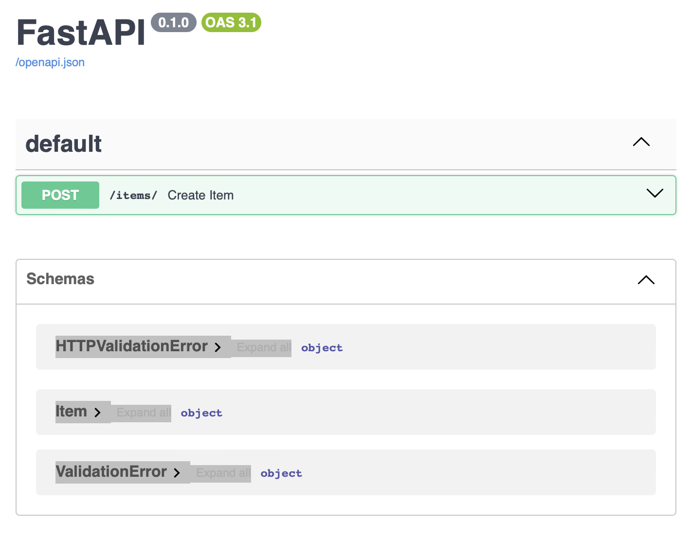
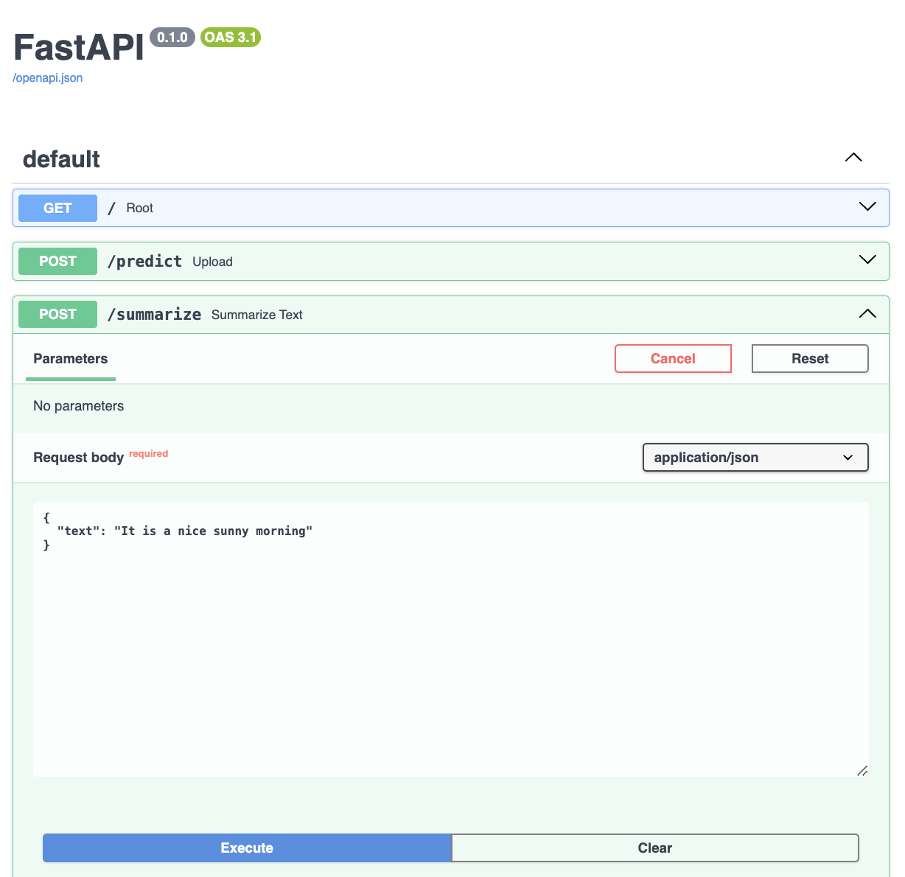
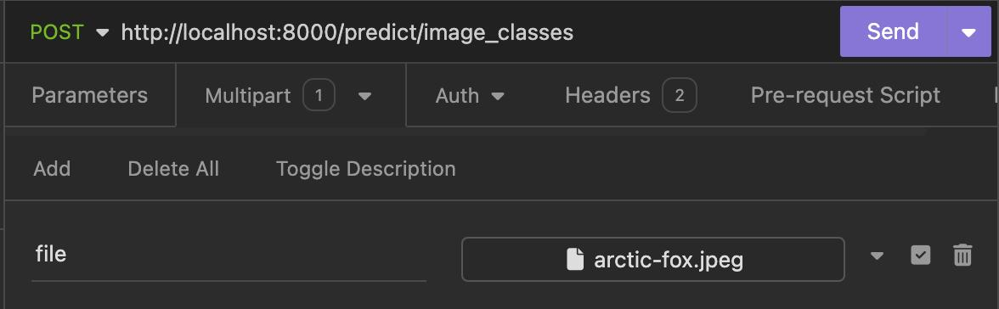

# Deploying Deep Learning Models as a Web Server

> By Mounish Pedagandham & Shreya Thakur

## Introduction

Deploying deep learning models as a web server enables real-time predictions and makes the model accessible via standard web protocols, making it an ideal approach for bringing machine learning models into production and ensuring they deliver value in a reliable and scalable manner. This documentation provides a comprehensive guide on deploying a deep learning model using FastAPI, a modern, fast (high-performance), web framework for building APIs with Python 3.7+.
There are various options of using web server:

1. Flask
2. Fast API
3. Django

We would work with FastAPI for our code demo.

## Why FastAPI?

FastAPI offers several advantages for deploying deep learning models:

- **High Performance**: FastAPI is much faster than the flask because it’s built over ASGI (Asynchronous Server Gateway Interface) instead of WSGI (Web Server Gateway Interface) s the flask is built on.
- **Ease of Use**: With automatic interactive API documentation and validation, FastAPI is easy to use and helps in rapid development. The framework follows the minimalist approach of Flask.
- **Type Safety**: FastAPI is designed around Python type hints, that makes code more readable and lowers the risk of runtime problems. It uses Starlette and Pydantic to achieve this.

## How to use FastAPI

### FastAPI Installation

```bash
pip install fastapi
```

FastAPI doesn’t come with any built-in server application. To run FastAPI app, you need an ASGI server called uvicorn, so install the same too.

```bash
pip install uvicorn
```

### Getting started with FastAPI

Declare the application object of FastAPI class. This app object is the main point of interaction of the application with the client browser. The `uvicorn` server uses this object to listen to client’s request.

```bash
app = FastAPI()
```

### Create a simple API

```bash
@app.get("")
def read_root():
    return {"Hello": "World"}
```

### Running the Server

To run the server, save the above code to a file `main.py`.
Execute the following command in your terminal:

```bash
uvicorn main:app --reload
```

This starts the FastAPI server with auto-reload enabled, so any changes to the code will automatically restart the server.

## Test the FastAPI Application

Open your web browser and go to http://127.0.0.1:8000. You should see a JSON response with the message:

```json
{
  "message": "Hello, World!"
}
```

### Adding new End-Point

Define a Pydantic model Item using `BaseModel` to validate the structure and types of incoming JSON data for the POST endpoint /items/.
Create a function, create_item. It will accept an Item object as input, and returns a JSON response containing the item's details (name, price, is_offer).

```python
from fastapi import FastAPI
from pydantic import BaseModel

app = FastAPI()

class Item(BaseModel):
    name: str
    price: float
    is_offer: bool = None

@app.post("/items/")
def create_item(item: Item):
    return {"name": item.name, "price": item.price, "is_offer": item.is_offer}
```

### Test the API with input

Use an API testing tool like Postman or curl to send a POST request to `http://127.0.0.1:8000/items/` with a JSON body:

```json
{
  "name": "Sample Item",
  "price": 10.5,
  "is_offer": true
}
```

You should receive a JSON response:

```json
{
  "name": "Sample Item",
  "price": 10.5,
  "is_offer": true
}
```

Congratulations on building your first API.

### Interactive API Docs

FastAPI generates a "schema" with all your APIs using the OpenAPI standard for defining APIs. The OpenAPI schema is what powers the two interactive documentation systems included in FastAPI.

To see the documentation, just add `/docs` to the API Endpoint URL (`http://127.0.0.1:8000/docs`). This link will show automatically generated interactive API documentation based on Swagger UI.



<!-- 

 -->

## Deploying Deep Learning Models

### Prerequisites

Before starting, ensure you have the following:

- Python 3.7+
- Docker

### Installation

#### Python Environment

First, set up a Python environment. It's recommended to use `venv` or `conda` for creating an isolated environment.

```bash
# Create a virtual environment
python -m venv myenv

# Activate the virtual environment
# On Windows
myenv\Scripts\activate

# On Unix or MacOS
source myenv/bin/activate
```

#### Installing dependencies

```bash
pip install fastapi uvicorn transformers torch torchvision
```

#### Project Structure

```
backend
├── README.md
├── app.py
└───utils.py
```

#### Importing the libraries

```python
import os
import logging
from fastapi import FastAPI, File, UploadFile, HTTPException
from utils import load_image, predict_octmnist
from fastapi.responses import JSONResponse
from pydantic import BaseModel
from transformers import pipeline
```

### Initializing the FastAPI object

```python
app = FastAPI()

# basic logging configuration to log all the debugging information
logging.basicConfig(
    level=logging.DEBUG,
    filename="app.log",
    filemode="a",
    format="%(asctime)s - %(levelname)s - %(message)s",
)

# install logger
logger = logging.getLogger(__name__)
```

We have also setup a logger for debugging purpose.

### Model used for the Web App

This tutorial provides a comprehensive guide on deploying a FastAPI application that integrates two different models:

1. **Image Classification**:  
   We have Utilized the **'nvidia/mit-b0'** model from Hugging Face's Transformers library to classify the imported file image.

2. **Text Summarization**:  
   We have used two models - **'T5-small'** and **'facebook/bart-large-cnn'** from Hugging Face's Transformers library. This model is capable of generating concise summaries of longer text documents given as input.

### Model Implementation

#### Loading the Model

```python
# Load the models when the server first starts
img_classification_model = load_img_classification_model()
t5_model = load_t5_model()
bart_summarizer = (
    load_bart_pipeline()
)
```

#### Root Endpoint

This endpoint serves as the root of the FastAPI application, providing a simple welcome message when accessed.
It confirms that the application is running and accessible.

```python
@app.get("/")
def root() -> dict:
    """
    Root endpoint returning a welcome message.

    Returns:
        dict: A dictionary containing a welcome message.
    """
    return {"message": "Welcome to the ML Model API"}

```

#### 1. Image Classification

The endpoint `/predict/image_classes` uses POST method and accepts an uploaded image file and predicts its class label from a set of 1000 ImageNet classes using image classification model - **nvidia/mit-b0 model**.

And, it returns a JSON response containing the predicted class label. The function for the api for model prediction is as below.

```python
@app.post("/predict/image_classes")
async def predict_img_class(file: UploadFile = File(...)) -> JSONResponse:
    """
    Endpoint to predict classes for each image among on the 1000 ImageNet classes.

    Args:
        file (UploadFile): The uploaded image file.

    Returns:
        JSONResponse: A JSON response containing the predicted class label.

    Raises:
        HTTPException: If any error occurs during processing.
    """
    try:
        # Load image from the uploaded file
        inputs = load_image(await file.read())

        # Load the model here or during the first start of the server
        # img_classification_model = load_img_classification_model()

        # Predict the class label for the input image
        predicted_class_label = predict_img_labels(inputs, img_classification_model)

    except Exception as exception:
        raise HTTPException(status_code=400, detail=str(exception))

    return JSONResponse(content={"class_label": predicted_class_label})

```

We have defined the following utility functions as below:

```python
from PIL import Image
from io import BytesIO
from typing import Dict, Any
from transformers import (
    SegformerImageProcessor,
    SegformerForImageClassification,
)


def load_image(data: bytes) -> Dict[str, Any]:
    """
    Load an image from bytes and preprocess it for model input.

    Args:
        data (bytes): The image data in bytes.

    Returns:
        Dict[str, Any]: A dictionary containing the preprocessed image tensor.
    """
    # Load the Segformer image processor
    image_processor = SegformerImageProcessor.from_pretrained("nvidia/mit-b0")
    # Open the image and convert it to RGB
    raw_image = Image.open(BytesIO(data)).convert("RGB")
    # Preprocess the image and return the tensor
    inputs = image_processor(images=raw_image, return_tensors="pt")

    return inputs


def load_img_classification_model() -> SegformerForImageClassification:
    """
    Load the Segformer image classification model.

    Returns:
        SegformerForImageClassification: The loaded Segformer image classification model.
    """
    return SegformerForImageClassification.from_pretrained("nvidia/mit-b0")


def predict_img_labels(
    inputs: Dict[str, Any], model: SegformerForImageClassification
) -> str:
    """
    Predict the class label for the given input image using the specified model.

    Args:
        inputs (Dict[str, Any]): The input image tensor.
        model (SegformerForImageClassification): The image classification model.

    Returns:
        str: The predicted class label.
    """
    # Get the model outputs and Extract the logits
    outputs = model(**inputs)
    logits = outputs.logits

    # Get the index of the predicted class
    predicted_class_index = logits.argmax(-1).item()

    # Return the class label corresponding to the predicted class index
    return model.config.id2label[predicted_class_index].split(", ")[0]

```

#### 2. Text Summarization

The endpoint enables user to provide parameter to specify the model to be utilized for summarization. Either **'T5-small'** or **'facebook/bart-large-cnn'**.  
The request accepts text to be summarized and returns the response in JSON format.

The function for the api for model prediction is as below.

```python
@app.post("/predict/text_summarize")
async def text_summarize(
    request: TextRequest, model: str = "t5", min: str = "30", max: str = "130"
) -> JSONResponse:
    """
    Endpoint to summarize text using the specified model.

    Args:
        request (TextRequest): The request body containing the text to summarize.
        model (str): The model to use for summarization (default is "t5").

    Returns:
        JSONResponse: A JSON response containing the summary.

    Raises:
        HTTPException: If any error occurs during processing.
    """
    try:
        # Raise an exception if the posted string is empty
        if not request.text.strip():
            raise HTTPException(status_code=400, detail=str("Text cannot be empty"))

        if model == "t5":
            # preprocess the input text
            sequence = request.text
            tokenizer = load_tokenizer()
            inputs = tokenizer.encode(
                "summarize: " + sequence,
                return_tensors="pt",
                max_length=512,
                truncation=True,
            )

            # Generate summary using the T5 model
            output = t5_model.generate(inputs, min_length=80, max_length=100)
            summary = tokenizer.decode(output[0])

        elif model == "bart":
            output = bart_summarizer(
                request.text, max_length=int(max), min_length=int(min), do_sample=False
            )
            summary = output[0]["summary_text"]

        else:
            raise HTTPException(status_code=400, detail=str("Invalid model specified."))

    except Exception as exception:
        raise HTTPException(status_code=400, detail=str(exception))

    return JSONResponse(content={"summary": summary})

```

We have defined the following utility functions as below:

```python
from typing import Dict, Any
from transformers import (
    AutoTokenizer,
    AutoModelWithLMHead,
    pipeline,
)

def load_tokenizer() -> AutoTokenizer:
    """
    Load the tokenizer for T5 model.

    Returns:
        AutoTokenizer: The loaded T5 tokenizer.
    """
    return AutoTokenizer.from_pretrained("T5-small")


def load_t5_model() -> AutoModelWithLMHead:
    """
    Load the T5 model for text generation.

    Returns:
        AutoModelWithLMHead: The loaded T5 model.
    """
    return AutoModelWithLMHead.from_pretrained("T5-small", return_dict=True)


def load_bart_pipeline() -> pipeline:
    """
    Load the BART pipeline for text summarization.

    Returns:
        pipeline: The loaded BART summarization pipeline.
    """
    return pipeline("summarization", model="facebook/bart-large-cnn")

```

### Running the Application

Run the FastAPI application using Uvicorn.

```bash
uvicorn app:app --host 0.0.0.0 --port 8000 --reload
```

### Deployment

For this project, we have used containerized deployment.
For this, create a `Dockerfile` inside the `backend` directory.

```bash
FROM python:3.12-slim

WORKDIR /app

COPY . .

RUN pip install fastapi uvicorn pillow torch transformers sentencepiece

EXPOSE 8000

CMD ["uvicorn", "app:app", "--host", "0.0.0.0", "--port", "8000", "--reload"]
```

We have also created a `docker-compose` file outside the `backend` directory for the ease of starting the containers.

```yml
services:
  backend:
    build: ./backend
    ports:
      - "8000:8000"
    volumes:
      - ./backend:/app
    environment:
      - CHOKIDAR_USEPOLLING=true
    container_name: backend
```

Build and run the Docker container on root directory:

```bash
docker-compose up --build
```

### Usage

Use an API testing tool like Postman or curl to send a POST request.

- **Image Classification**

  - Set the request method to POST
  - Enter endpoint URL - `http://localhost:8000/predict/image_classes`

  

  

  - Response:

  ```json
  {
    "class_label": "Arctic fox"
  }
  ```

- **Text Summarization**

  - Set the request method to POST - Enter endpoint URL
  - `http://localhost:8000/predict/text_summarize?model=bart&min=10&max=30`
  - JSON body:

  ```json
  {
    "text": "Jackie Robinson Commemorative Coin Act - Directs the Secretary of the Treasury to: (1) mint and issue one-dollar silver coins emblematic of Jackie Robinson in commemoration of the 50th anniversary of the breaking of the color barrier in major league baseball; and (2) distribute surcharge proceeds to the Jackie Robinson Foundation to enhance its education and youth leadership programs, and increase the availability of scholarships for economically disadvantaged youths."
  }
  ```

  - Recieved Response as JSON

  ```json
  {
    "summary": "Jackie Robinson Commemorative Coin Act - Directs the Secretary of the Treasury to issue one-dollar silver coins emblematic of Jackie"
  }
  ```

  - We have specified the `min` and `max` query parameters and the model as `bart` for this text summarization.

## Where to Go from Here

- We can delve deeper into our API endpoints for image classification and text summarization. Also, experiment with different inputs to understand the capabilities and performance of our models. For this, we could refer to the endpoint documentation to explore all available options and parameters for customization.

- We can integrate with frontend technologies by building a user-friendly interface using HTML, CSS, and JavaScript to interact with our API. For this, we need to connect API requests and responses seamlessly to create a dynamic user experience by incorporating frameworks like React or Vue.js for building more interactive and responsive interfaces.

- We can Implement asynchronous processing for computationally intensive tasks within your FastAPI application by utilizing FastAPI's built-in support for `background tasks` to handle long-running operations such as model inference or data preprocessing asynchronously.

- We can Optimize Model Deployment to streamline library dependencies and enhance portability by converting our models into ONNX format. This approach reduces the number of required libraries and simplifies integration into different environments.

## Tasks

- We can try to get the accuracy of the model and relay it back to the user in the API response.
- Write a simple `streamlit` app using `python` to access the api end points.

## References

1. ⁠https://huggingface.co/datasets/FiscalNote/billsum
2. ⁠⁠https://huggingface.co/google-t5/t5-small
3. ⁠⁠https://huggingface.co/facebook/bart-base
4. ⁠⁠https://huggingface.co/datasets/abisee/cnn_dailymail/viewer/1.0.0/test
5. ⁠⁠https://huggingface.co/docs/transformers/en/model_doc/segformer
6. ⁠⁠https://medium.com/artificialis/t5-for-text-summarization-in-7-lines-of-code-b665c9e40771
7. ⁠⁠https://fastapi.tiangolo.com/#interactive-api-docs
